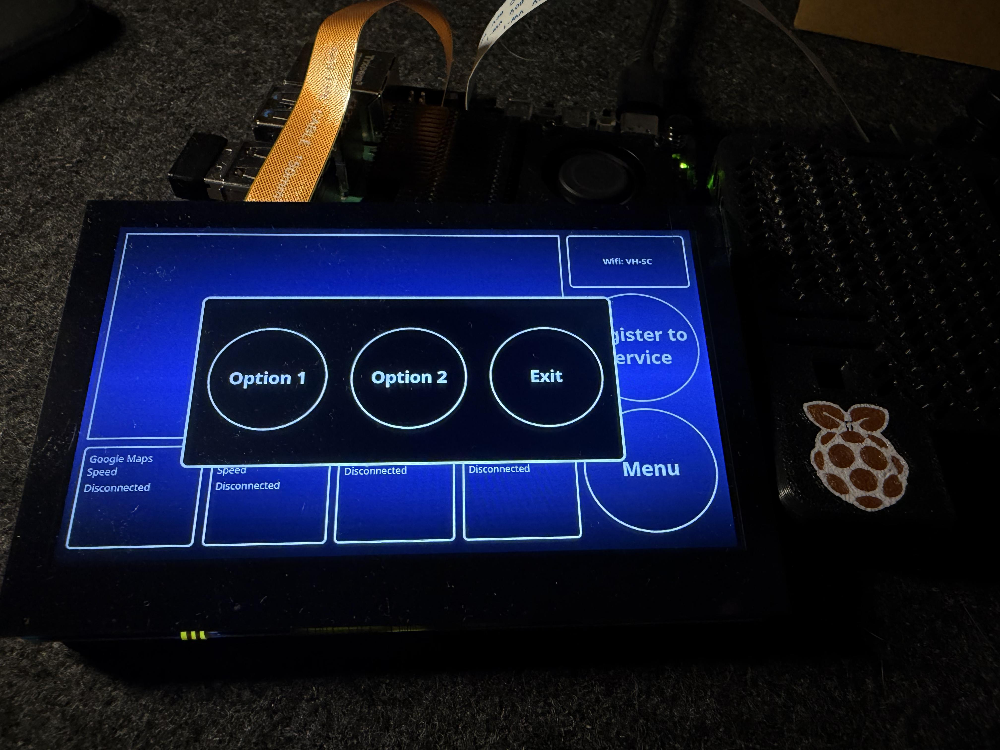
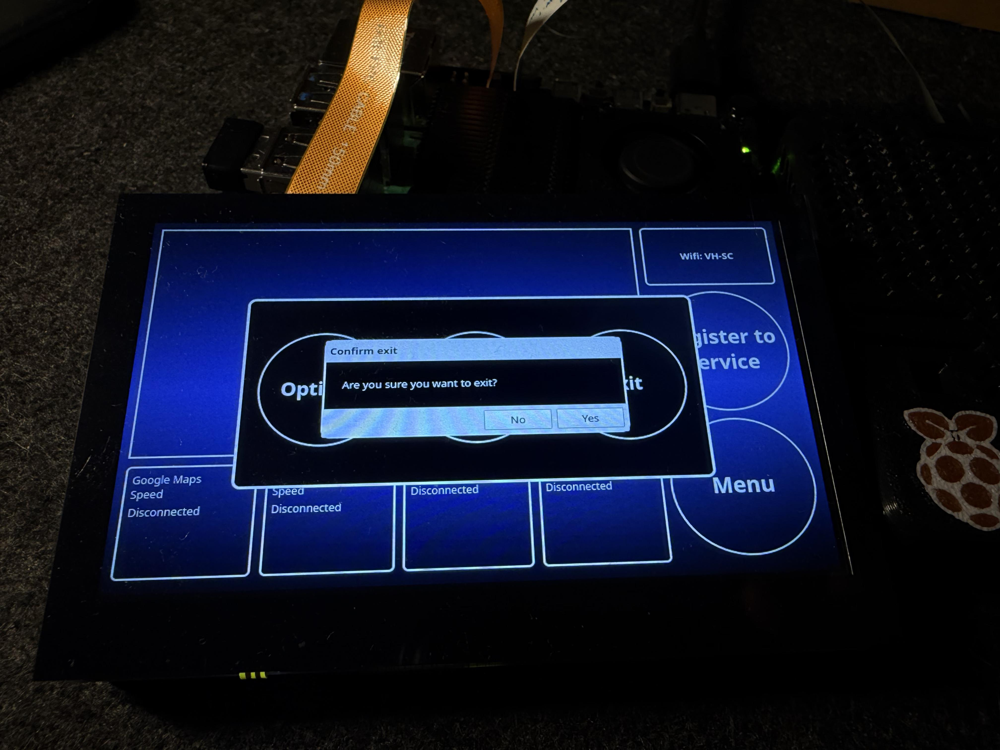
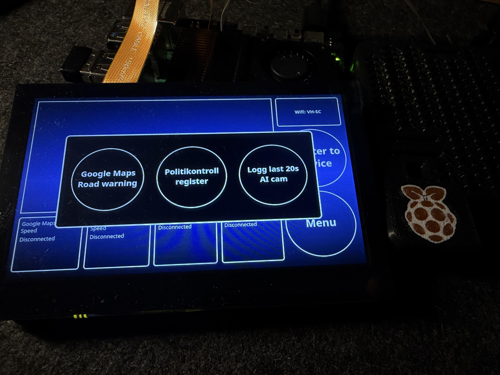
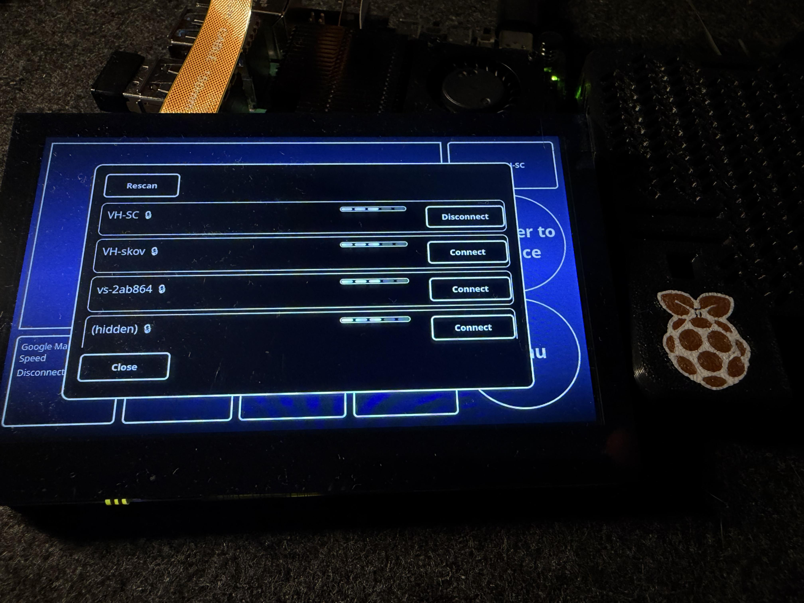

# First Look at the GUI

This is the first look at the Roadie interface running on the Raspberry Pi 5 touchscreen.

The layout, buttons, and info panels are now live, showing the foundation of the in-car AI companion system.

The functionalities for the buttons are now being developed as we speak.

# Second Look at the GUI

Adding buttons functionalities.

